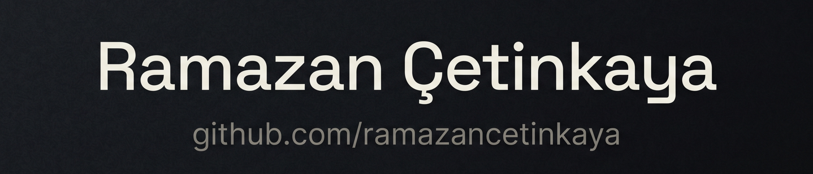

  

   

  

###

### Most Starred Projects
<!-- START_SECTION:starred -->

| # | Repository | Description | Language | ⭐ Stars | Last Updated |
| :-: | :-- | :-- | :-: | :-: | :-: |
| **1** | [**password-generator**](https://github.com/ramazancetinkaya/password-generator) | A modern and simple password generator built using HTML, CSS and JS to crea... | `HTML` | 155 | `2026-06-09` |
| **2** | [**tictactoe**](https://github.com/ramazancetinkaya/tictactoe) | Challenge a smart, heuristic-based AI in this sleek Tic-Tac-Toe game. Built... | `JavaScript` | 155 | `2025-08-29` |
| **3** | [**snake-game**](https://github.com/ramazancetinkaya/snake-game) | An implementation of the classic Snake game using HTML5, CSS, and JavaScrip... | `JavaScript` | 146 | `2024-12-23` |
| **4** | [**mysql-backup**](https://github.com/ramazancetinkaya/mysql-backup) | A powerful and modern PHP library for backing up and restoring MySQL databa... | `PHP` | 119 | `2024-05-10` |
| **5** | [**morse-code**](https://github.com/ramazancetinkaya/morse-code) | A simple PHP library for converting text to Morse code and vice versa. | `PHP` | 97 | `2025-02-22` |

<!-- END_SECTION:starred -->

### Most Forked Projects
<!-- START_SECTION:forked -->

| # | Repository | Description | Language | 🍴 Forks | Last Updated |
| :-: | :-- | :-- | :-: | :-: | :-: |
| **1** | [**mysql-backup**](https://github.com/ramazancetinkaya/mysql-backup) | A powerful and modern PHP library for backing up and restoring MySQL databa... | `PHP` | 108 | `2024-05-10` |
| **2** | [**morse-code**](https://github.com/ramazancetinkaya/morse-code) | A simple PHP library for converting text to Morse code and vice versa. | `PHP` | 81 | `2025-02-22` |
| **3** | [**snake-game**](https://github.com/ramazancetinkaya/snake-game) | An implementation of the classic Snake game using HTML5, CSS, and JavaScrip... | `JavaScript` | 79 | `2024-12-23` |
| **4** | [**tictactoe**](https://github.com/ramazancetinkaya/tictactoe) | Challenge a smart, heuristic-based AI in this sleek Tic-Tac-Toe game. Built... | `JavaScript` | 73 | `2025-08-29` |
| **5** | [**todolist**](https://github.com/ramazancetinkaya/todolist) | A modern, highly intuitive, and responsive Kanban-based todo list applicati... | `HTML` | 62 | `2026-05-30` |

<!-- END_SECTION:forked -->

###

<h2>Technical Stack</h2>

  <table>
    <tbody>
      <tr>
        <td align="center" width="180">
           
          <b>Languages</b>
        </td>
        <td align="left" width="600">
          
          
          
          
        </td>
      </tr>
      <tr>
        <td align="center" width="180">
           
          <b>Frameworks</b>
        </td>
        <td align="left" width="600">
          
        </td>
      </tr>
      <tr>
        <td align="center" width="180">
           
          <b>CMS</b>
        </td>
        <td align="left" width="600">
          
        </td>
      </tr>
      <tr>
        <td align="center" width="180">
           
          <b>Runtimes</b>
        </td>
        <td align="left" width="600">
          
        </td>
      </tr>
      <tr>
        <td align="center" width="180">
           
          <b>Web Servers</b>
        </td>
        <td align="left" width="600">
          
          
        </td>
      </tr>
      <tr>
        <td align="center" width="180">
           
          <b>Frontend</b> 
          (Personal projects only)
        </td>
        <td align="left" width="600">
          
          
          
          
        </td>
      </tr>
      <tr>
        <td align="center" width="180">
           
          <b>Databases & BaaS</b>
        </td>
        <td align="left" width="600">
          
          
          
        </td>
      </tr>
      <tr>
        <td align="center" width="180">
           
          <b>Cybersecurity</b>
        </td>
        <td align="left" width="600">
          
          
          
          
          
          
          
        </td>
      </tr>
      <tr>
        <td align="center" width="180">
           
          <b>DevOps</b>
        </td>
        <td align="left" width="600">
          
          
        </td>
      </tr>
      <tr>
        <td align="center" width="180">
           
          <b>Cloud</b>
        </td>
        <td align="left" width="600">
          
        </td>
      </tr>
      <tr>
        <td align="center" width="180">
           
          <b>Tools</b>
        </td>
        <td align="left" width="600">
          
        </td>
      </tr>
      <tr>
        <td align="center" width="180">
           
          <b>Systems</b>
        </td>
        <td align="left" width="600">
          
          
          
        </td>
      </tr>
    </tbody>
  </table>

## Get in Touch

> [!NOTE]
> I am currently focused on active cybersecurity and backend development projects, so I may be a bit slower than usual in responding to GitHub Issues or Pull Requests. Thanks for your patience!

> [!IMPORTANT]
> I am aware that legacy email addresses remain in some of my older repositories as I work on updating them; please refer to this section for my most current and verified contact information.

### 📬 E-mail

If you have an urgent matter or a professional inquiry, you can reach me directly via email:

**Email:** `ramazancetinkayasolutions@protonmail.com`

**To keep our communication secure and efficient, I follow a simple protocol:**

* URL shorteners are automatically filtered for safety, but direct links to reputable developer platforms or official documentation are acceptable for context.
* Refrain from including any attachments or files, as these will be automatically discarded to maintain the security of the communication channel.
* Plain text is preferred for a faster and safer review.

  <h2>Github Repository Statistics</h2>
  
  

    
###
  

  

---

  <kbd>
    <b>Last Updated:</b> April 19, 2026
  </kbd>

